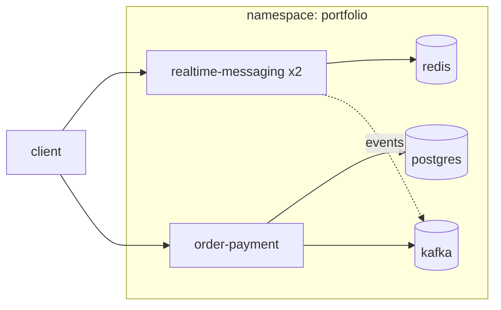

# platform

Kubernetes deployment that runs the two backend services together on one cluster —
[realtime-messaging](https://github.com/jinwovo/realtime-messaging) and
[order-payment](https://github.com/jinwovo/order-payment) — alongside their infrastructure
(Redis, PostgreSQL, Kafka). Runs on a local **[kind](https://kind.sigs.k8s.io/)** cluster (see Deploy).

## What it demonstrates

- Both services deployed as containers in one namespace, wired to in-cluster infra by Service DNS
  (`redis`, `postgres`, `kafka`) — no hardcoded hosts.
- **realtime-messaging runs 2 replicas behind a single Service.** For a message to reach a subscriber,
  cross-instance routing through Redis Pub/Sub has to work — the same property the service was built
  for, now exercised by real load-balanced pods. Each pod reports its own `INSTANCE_ID` (its pod name).
- order-payment gates startup on Postgres (init container), runs its Flyway migrations, and publishes
  to Kafka — the full reliability stack running in-cluster.

## Architecture



## Layout

```
k8s/
├── 00-namespace.yaml
├── 10-redis.yaml
├── 11-postgres.yaml
├── 12-kafka.yaml
├── 20-realtime-messaging.yaml   # replicas: 2
└── 21-order-payment.yaml
```

## Deploy (kind)

```bash
# 1. cluster
kind create cluster --name portfolio

# 2. build the app images and load them into the cluster (no registry required)
docker build -t realtime-messaging:latest ../realtime-messaging
docker build -t order-payment:latest ../order-payment
kind load docker-image realtime-messaging:latest order-payment:latest --name portfolio

# 3. apply and watch
kubectl apply -f k8s/
kubectl -n portfolio get pods -w
```

## Verify

```bash
# realtime-messaging: two pods, one Service
kubectl -n portfolio port-forward svc/realtime-messaging 8080:8080
curl localhost:8080/api/instance        # the pod serving you (round-robined across replicas)

# order-payment: place an order through the cluster
kubectl -n portfolio port-forward svc/order-payment 8090:8090
curl -s localhost:8090/orders -H 'Idempotency-Key: k8s-1' -H 'Content-Type: application/json' \
  -d '{"lines":[{"sku":"SKU-MOUSE","quantity":1}]}'
```

## Notes & roadmap

- App images use `imagePullPolicy: IfNotPresent` and are side-loaded into kind — no registry needed.
- Infra runs on ephemeral storage here; production would use StatefulSets + PersistentVolumeClaims.
- Next: Prometheus/Grafana (kube-prometheus-stack), an Ingress in front of the Services, and
  resource requests/limits per workload.
